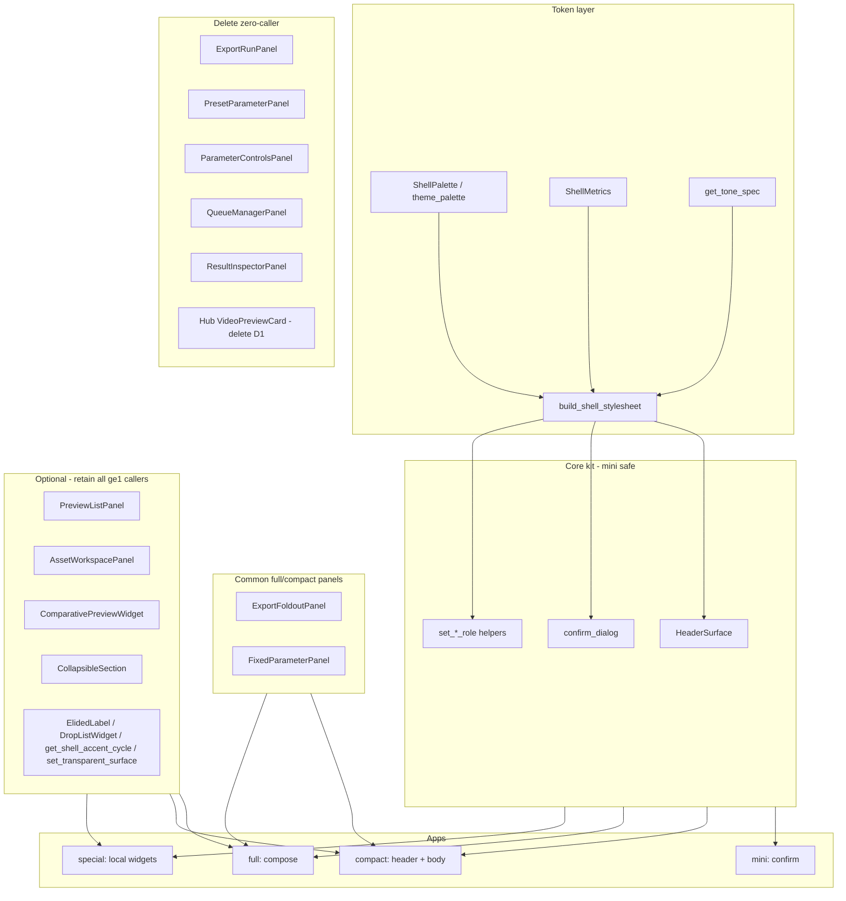
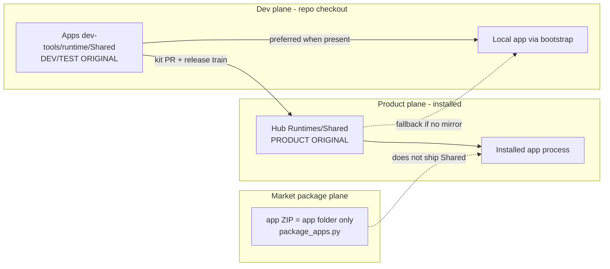
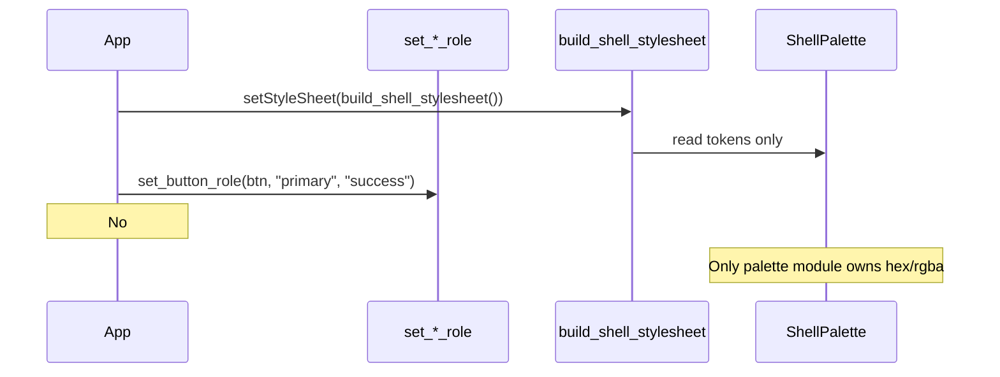
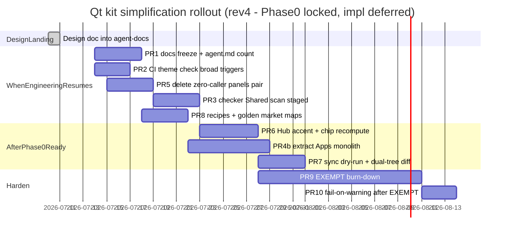

> **Canonical design for Qt GUI Design System Simplification.**  
> Phase 0 decisions locked **2026-07-10** (SSOT two-plane, Hub accent `#3A82FF`, extract Apps monolith, VideoPreviewCard delete with D1).  
> **Implementation PRs deferred** — this session lands the design document only.  
> Working/temp source used during authoring: `C:/Users/HG_maison/AppData/Local/Temp/grok-design-doc-219a56b8.md` (rev. 4).  
> Related contracts: `agent-docs/gui-runtime-contract.md`, `gui-runtime-status.md`, `qt-component-catalog.md`.
# Design: Qt GUI Design System Simplification (Contexthub-Apps)

| Field | Value |
| --- | --- |
| **Author** | (TBD) |
| **Date** | 2026-07-10 |
| **Status** | **Accepted — Phase 0 decisions locked (2026-07-10)** · rev. 4 · **implementation PRs deferred** (design-doc landing only this session) |
| **Primary workspace** | `C:\Users\HG_maison\Documents\Contexthub-Apps` |
| **Product Shared runtime** | `C:\Users\HG_maison\Documents\Contexthub\Runtimes\Shared` (**product original**) |
| **Dev Shared mirror** | `Contexthub-Apps/dev-tools/runtime/Shared` (**dev/test original**) |
| **Repo copy** | `agent-docs/designs/2026-07-10-qt-gui-design-system-simplification.md` |
| **Audience** | Contexthub-Apps maintainers, hub Shared runtime owners |

---

## Overview

Contexthub-Apps의 Qt 마켓 앱(~28개)은 공유 셸(`contexthub.ui.qt.shell`), 패널 카탈로그, manifest `ui.template` 버킷(full/compact/mini/special), 역할/톤 API, 검사 스크립트, 다층 문서로 “중앙 디자인 시스템”을 지향해 왔다. 그러나 실제 효과는 **개념 수 증가 + 색 출처 분산 + 문서/코드 드리프트**로 유지보수 비용이 올라간 상태다.

본 설계는 **더 많은 레이어를 얹지 않고**, 사용되지 않는 개념·패널·문서 축을 삭제하고, 색/토큰 경로를 하나로 고정하며, **두 평면(dev mirror / product Hub)의 SSOT 규칙과 릴리즈 게이트**를 명확히 하는 **구조 축소(Thin Shell + Optional Components)** 를 제안한다. 새 앱은 “템플릿 베이스 클래스 상속”이 아니라 `stylesheet + HeaderSurface + 필요한 패널 0~N개` 조합으로 시작한다. special 앱은 heavy base를 강제하지 않는다.

### Phase 0 locked (2026-07-10) — final

| Topic | Decision |
| --- | --- |
| **Q1 SSOT** | **Product** = Hub `Runtimes/Shared`. **Dev/test** = Apps `dev-tools/runtime/Shared`. Market ZIP **never** ships Shared. **K13** release gate required on kit behavior changes. |
| **Q3 Palette** | Product accent = Hub **`#3A82FF`**. Recompute chips / soft fills / ManualDialog third-accent families from that accent. Apps palette **converges to Hub values** (+ full field matrix, Appendix D). |
| **Q9 Modularize** | **Extract Apps monolith** (do **not** blind-copy Hub). Hub file keep list is **reference only**; no dead Hub APIs into Apps. |
| **This session** | Land design into `agent-docs/designs/` only — **do not implement code PRs now**. |

Unblocked implementation track (when engineering resumes): PR1 → PR2 → PR5 → PR3 → PR8, then PR6 (Hub accent) / PR4b (extract) / PR7.

---

## Background & Motivation

### Current state (verified 2026-07-10)

| Signal | Evidence |
| --- | --- |
| Market size | **28** apps with `manifest.json` (`agent-docs/agent.md`의 “43개”는 구식 — PR1에서 수정) |
| Template buckets | full=8, compact=5, mini=8, special=7 — 전부 manifest에 `ui.template` 존재 |
| Shared Qt tree (Apps) | `dev-tools/runtime/Shared/contexthub/ui/qt/` — **7** `.py` files; `shell.py` ≈ 40,235 bytes / 1,122 lines monolith + `panels_*.py` + `confirm_dialog.py` |
| Shared Qt tree (Hub) | `Contexthub/Runtimes/Shared/contexthub/ui/qt/` — **~30** modules (`theme_*.py`, `header.py`, `widgets.py`, split panels, `video_preview_card.py`, …) |
| Packaging | `.github/scripts/package_apps.py` zips **app folder only** — **Shared is never shipped inside market ZIPs** |
| Product import path | Installed hub: apps resolve `contexthub.ui.qt` from **Hub `Runtimes/Shared`** (no Apps repo on disk) |
| Theme check baseline | `python dev-tools/check-gui-theme-contract.py` → `errors=0 warnings=0 exemptions=3` |
| Checker scope | `_iter_python_paths()` skips entire `dev-tools` via `SKIP_PARTS` → allowlist on `shell.py` is **never scanned**; enforcement is app-tree only |
| CI | `.github/workflows/market-release.yml` packages only — **no** theme contract step |

### Pain points (code-verified)

#### 1. Color dual-source / token drift

- Apps `ShellPalette` (`shell.py`) vs Hub `theme_palette.py` — 필드 단위 불일치 (Appendix D). 대표: accent `#4B8DFF` vs `#3A82FF`; Hub `chip_*`는 여전히 Apps accent RGB(`75, 141, 255`)를 써서 **Hub palette 내부도 불일치**.
- Hub-only fields: `surface_subtle_ghost`, `error_soft`.
- special 앱 3 EXEMPT: `ai_text_lab_qt_app.py`, `subtitle_qc_qt_app.py`, `versus_up_qt_widgets.py`.
- 카테고리 `theme_contextup.json` — CTk/`gui_lib` 유산; Qt 편차 주원인은 아님.

#### 2. Too many concepts vs actual usage

`qt-component-catalog.md`는 `InputCard`, `PreviewCard`, `ExecutionCard`, `FullSplitWorkspace` 등 **코드에 없는 개념**을 정의. 실측 사용:

| Symbol | App/engine files | Tier |
| --- | --- | --- |
| `build_shell_stylesheet` | ~27 | **Core** |
| `HeaderSurface` | ~23 | **Core** |
| `apply_app_icon` | ~23 | **Core** |
| `attach_size_grip` | ~22 | **Core** |
| `get_shell_metrics` | ~26 | **Core** |
| `get_shell_palette` | ~17 | **Core** |
| `refresh_runtime_preferences` / `runtime_settings_signature` | ~17 | **Core** (compat stubs — retain) |
| `ExportFoldoutPanel` | ~13 | **Common full/compact** (not mini) |
| `FixedParameterPanel` | ~12 | **Common full/compact** (not mini) |
| `run_confirm_dialog` | ~7 | **Core** (mini; also some compact) |
| `set_surface_role` / `set_button_role` / `set_badge_role` | 4–6 | **Core** (token API) |
| `PreviewListPanel` | ~6 | **Optional** |
| `get_shell_accent_cycle` | **3** (versus_up, qwen3_tts, …) | **Optional (shell helper)** — **must retain** |
| `ElidedLabel` | **2** (versus_up, audio_toolbox) | **Optional (shell helper)** — **must retain** |
| `set_transparent_surface` | **2** (youtube_downloader + panels) | **Optional (shell helper)** — **must retain** |
| `DropListWidget` | **1+** (`split_channel_qt_app` + internal PreviewList) | **Optional (shell helper)** — **must retain** |
| `AssetWorkspacePanel` | **2** (`creative_studio_advanced`, `creative_studio_z`) | **Optional (domain)** — **must retain** |
| `CollapsibleSection` | **2** (same Comfy apps; from `shell`) | **Optional (domain)** — **must retain** |
| `ComparativePreviewWidget` | **2–3** (`image_compare`, `rigreader_vectorizer`, …) | **Optional (domain)** — **must retain** |
| `ExportRunPanel` | **0** | **Delete** |
| `PresetParameterPanel` | **0** | **Delete** |
| `ParameterControlsPanel` | **0** | **Delete** |
| `QueueManagerPanel` | **0** | **Delete** |
| `ResultInspectorPanel` | **0** | **Delete** |
| Hub-only `VideoPreviewCard` | **0** Apps callers | **Delete with D1** (Q11 locked) |

#### 3. Split ownership + packaging plane gap

Market ZIP ≠ Shared runtime. Bootstrap prefers **Apps mirror when present**, so local dev can hide product (Hub) colors/structure until install.

Full candidate lists: see [Bootstrap resolution (verbatim)](#bootstrap-resolution-verbatim).

#### 4. Docs drift

`gui-runtime-contract`, `gui-runtime-status`, `gui-cleanup-backlog`, `qt-component-catalog`, agent skills — 복수 SSOT 문서. Enforcement prose-only.

#### 5. Centralization tax

mini = confirm thin; full = compose panels; special paints over shell. Shared `BaseAppWindow` **없음** (건강). Category-local bases (`mesh_qt_shared`) OK.

### Why change now

1. Market ~28 + SystemC absorption → kit 범위 명확.
2. raw-color warnings ≈ 0 → 병목은 구조/개념.
3. Hub modular vs Apps monolith → 드리프트 고착 중.
4. role/tone API 이미 존재 → 레이어 추가가 답이 아님.

---

## Goals & Non-Goals

### Goals

1. **Fewer concepts** — 삭제 우선.
2. **Single color/token path** — palette only owns hex/rgba; checker must scan kit modules to enforce.
3. **Clear two-plane SSOT** — dev mirror vs product Hub + release gate for any kit behavior change.
4. **Progressive adoption** — mini/special thin; full optional panels; retain all ≥1-caller symbols.
5. **Enforcement** — one script + CI, not prose-only.

### Non-Goals

- 모든 앱 픽셀 퍼펙트 재디자인 1PR
- Demucs/AI 제품 통합
- Hub SystemC(WPF) full rewrite — 토큰 **이름** 정렬만
- 새 `BaseAppWindow` / shared template base classes
- CTk `theme_contextup.json` 전면 삭제 — **out of scope this program** (Q7 locked)
- **Removing category-local template layout switches** (e.g. `MeshModeSpec.template`) — see carve-out below
- Blind-copying Hub modular tree into Apps (Q9 locked = **extract only**)
- Implementing code PRs in the same session as this design landing (user deferred)

---

## Phase 0 — Decision record (**LOCKED** 2026-07-10)

| ID | Status | Decision |
| --- | --- | --- |
| **Q1** | **Resolved** | Product original = Hub `Runtimes/Shared`. Dev/test original = Apps `dev-tools/runtime/Shared`. ZIP never ships Shared. K13 gate. |
| **Q3** | **Resolved** | Accent = Hub `#3A82FF`. Apps → Hub field values. Recompute chips/soft/ManualDialog (`61,139,255` etc.) from product accent. Adopt Hub-only fields (`surface_subtle_ghost`, `error_soft`). |
| **Q9** | **Resolved** | **Extract Apps monolith.** Do not blind-copy Hub. Appendix E = reference keep/drop only. |
| **Q2** | Provisional default | **No** external consumers outside the two Shared trees; **reconfirm with `rg` at D1**. |
| **Q4** | Default locked | Keep `ui.template` enum `{full,compact,mini,special}`. |
| **Q5** | Default locked | **git/sync only** — no `KIT_VERSION` / manifest field unless later need. |
| **Q6** | Default locked | Keep `creative_studio_*` as **full** until a later recategorize. |
| **Q7** | Default locked | `theme_contextup.json` **out of scope** this program. |
| **Q8** | Default locked | `--fail-on-warning` only **after** EXEMPT burn-down progress (PR10 after PR9), not before. |
| **Q10** | Default locked | SystemC token name sheet lives in **Apps `agent-docs` first**. |
| **Q11** | **Resolved** | **Delete** Hub `VideoPreviewCard` with D1 (0 Apps callers). |

Phase 0 no longer blocks PR4b/PR6/PR7 **design readiness**. **Implementation remains deferred** until a later engineering session (user choice: design-doc only now).

---

## Proposed Design

### Decision summary (preferred alternative: **B**)

**Thin Shell + Optional Components.**  
Default path = stylesheet + few primitives. Heavy panels optional. Template buckets = **maintenance tags** (plus legitimate capture/category consumers — not shared base loaders).



### Two-plane SSOT & packaging (normative)



| Plane | Path | Role |
| --- | --- | --- |
| **Product original** | `Contexthub/Runtimes/Shared` | Installed users import this. Kit **behavior done** only when this is updated + product ships it. |
| **Dev/test original** | `Contexthub-Apps/dev-tools/runtime/Shared` | Local bootstrap prefers this; good place to **author and test** with market apps in same PR. |
| **Market ZIP** | `{category}/{app_id}/` only | Never contains Shared. Apps-only kit PR is **invisible** to marketplace users until Hub ships. |

**Release gate (K13):** Every PR that changes kit **behavior** (palette tokens, public exports, stylesheet semantics, panel delete) must name one of:

1. Linked Hub PR / commit that applies the same change, or  
2. Sync script invocation that copies the agreed qt subtree, or  
3. Explicit exception: “Apps-dev-only tooling / docs / checker — no runtime behavior.”

Optional CI (when both trees available on runner): fail if `theme_palette` fields or public `__all__` diverge (PR7).

### Bootstrap resolution (verbatim)

From `runtime_bootstrap.py`:

**`_candidate_shared_roots(app_root)`** (first existing wins):

1. `CTX_SHARED_RUNTIME_ROOT` (if set)
2. `{app_root}/Runtimes/Shared`
3. `{repo_root}/dev-tools/runtime/Shared` where `repo_root = app_root.parents[1]`
4. `{repo_root.parent}/Contexthub/Runtimes/Shared`
5. `{app_root.parent.parent}/Contexthub/Runtimes/Shared`

**`_candidate_runtime_roots(app_root)`** (first existing wins):

1. `CTX_RUNTIME_ROOT`
2. `CTX_DEV_RUNTIME_ROOT`
3. `{repo_root}/dev-tools/runtime`
4. `{repo_root.parent}/Contexthub/Runtimes`
5. `{app_root.parent.parent}/Contexthub/Runtimes`

**Implication:** With both Apps mirror and sibling Hub present, **Apps mirror wins** over Hub (after env and app-local). Engineers may never see product colors until install or `CTX_SHARED_RUNTIME_ROOT` force.

**Debug:** log `resolve_shared_runtime` result once under a debug flag / `CTX_LOG_SHARED_ROOT=1` (Observability).

### Target package layout (after modularization — **not** required for D1)

**Important:** Hub modular tree is **not** a drop-in behavior-neutral copy into Apps (extra palette fields, split stylesheets, dead modules). **Q9 locked = extract Apps monolith only.**

| Strategy | Status |
| --- | --- |
| **Q9-A Extract Apps monolith** | **LOCKED — do this** |
| **Q9-B Selective Hub→Apps copy** | **Rejected** — Hub tree is reference only; do not import dead APIs (`VideoPreviewCard`, deleted panels, etc.) |

**PR4 split:**

- **PR4a (optional, low risk):** thin façade re-exports only if needed — skip if no value.
- **PR4b (ready when engineering resumes):** **extract** Apps `shell.py` monolith into theme/header/widgets modules; use Appendix E as layout **reference**, not a file dump; golden **visual capture** required.

Target shape after extract:

```
contexthub/ui/qt/
  theme_palette.py      # ONLY raw color literals (after modularize)
  theme_metrics.py
  theme_tone.py
  theme_style_helpers.py
  theme_stylesheet*.py  # palette/metrics only — no raw hex
  theme.py
  shell.py              # thin re-export façade
  header.py
  widgets.py            # includes CollapsibleSection
  manual.py / support.py
  confirm_dialog.py
  panels.py             # re-export LIVE panels only
  panels_export.py      # ExportFoldoutPanel only
  panels_parameters.py  # FixedParameterPanel only
  panels_preview.py     # PreviewListPanel, ComparativePreviewWidget, AssetWorkspacePanel
```

### Color / token single path



**Rules:**

1. Raw hex/rgba owner: `theme_palette.py` (transitional: palette dataclass region in Apps `shell.py`).
2. Stylesheet modules: interpolate only.
3. App code: no color literals in stylesheet-heavy files (existing + EXEMPT).
4. Converge via **field matrix** (Appendix D), not accent-only. After converge, fix Hub-internal chip vs accent inconsistency.
5. **Non-palette kit literals** (ManualDialog, Hub `theme_stylesheet_*`) are **debt**, not part of “palette done.” Migrate in staged PR3 burn-down and/or PR6 — see Appendix D note and Enforcement stages.

### Template buckets: tag + legitimate consumers

| Consumer | Allowed? |
| --- | --- |
| `ui.template` in manifest | **Yes** — maintenance / inventory tag; enum enforced in checker |
| Capture tools (`capture-python-gui-apps.ps1`, `gui_capture_launcher.py`) | **Yes** — legitimate tag consumers |
| Category-local layout (`mesh_qt_shared.MeshModeSpec.template` → size/layout) | **Yes** — **carve-out**; not shared kit |
| Shared kit growing `if template == "full": BaseFullWindow` | **No** |

**Recipes:**

| Tag | Default composition | Market golden (Appendix A) | Implementation golden |
| --- | --- | --- | --- |
| `mini` | `run_confirm_dialog` only | `extract_textures`, `extract_bgm`, `cad_to_obj` | same `main.py` paths |
| `compact` | shell + `HeaderSurface` + body + CTA; optional FixedParameter | `auto_lod`, `doc_convert`, `simple_normal_roughness` | `auto_lod_qt_window.py` |
| `compact` exception | confirm dialog OK | `split_exr` (manifest compact + `run_confirm_dialog`) | allowed pattern |
| `full` | shell + Header + optional PreviewList / FixedParameter / ExportFoldout | `audio_toolbox`, `doc_scan`, `merge_to_exr`, `image_compare` | engine: `upscale_qt_app.py`, `bg_removal_qt_app.py` (not always market IDs) |
| `full` domain-optional | + `AssetWorkspacePanel` / `CollapsibleSection` | `creative_studio_advanced`, `creative_studio_z` | Comfy engines |
| `full` compare | + `ComparativePreviewWidget` | `image_compare`, `rigreader_vectorizer` | — |
| `special` | stylesheet + optional Header + app-local widgets | `versus_up`, `qwen3_tts`, `ai_text_lab` | EXEMPT burn-down track |

### Progressive adoption matrix

| App class | Must use | May use | Must not force |
| --- | --- | --- | --- |
| mini | confirm, theme contract | — | panels |
| compact | stylesheet, Header, roles | FixedParameter, confirm | queue/result panels |
| full | stylesheet, Header | PreviewList, FixedParameter, ExportFoldout, AssetWorkspace, Comparative, Collapsible | BaseAppWindow |
| special | stylesheet or EXEMPT plan, `shared_theme=contexthub` | any live optional | entire phantom catalog |

### Delete / deprecate plan

**D1 — Zero-caller panels (paired Apps + Hub)**

| Action | Apps | Hub |
| --- | --- | --- |
| Remove from `panels.py` `__all__` | yes | yes |
| Delete implementations | `panels_*.py` sections / files as applicable | also `export_run_panel.py`, `queue_manager_panel.py`, `result_inspector_panel.py`, etc. |
| Checker banned imports | yes | N/A for Hub tree unless multi-checkout |

- Apps market code: **0 callers** (safe).
- Hub non-Shared product callers: **none found** in review (Q2 largely verified) — still re-`rg` at PR time.
- Deprecation stubs: **only if** unpublished external consumers appear (default: **hard delete** same release train).
- **Do not** Apps-delete while Hub retains modules long-term — that **increases** drift.

#### Cross-repo D1 procedure (normative)

Hub `Runtimes/Shared` and Apps `dev-tools/runtime/Shared` are **separate trees/repos**. Apps GitHub Actions will **not** usually have sibling Hub checked out, so “Hub modules gone” is a **process + link** gate, not an Apps-only CI assertion.

| Step | Rule |
| --- | --- |
| 1 | Open **Hub PR** deleting zero-caller modules + updating Hub `panels.py` exports. |
| 2 | Open **Apps PR** with the same surface delete on the mirror. |
| 3 | **Preferred order:** Hub PR merges first **or** both land the **same calendar day** on the release train. |
| 4 | Apps PR body **must** link Hub PR URL **and** merged Hub commit SHA (or, if Hub not yet merged: open Hub issue with milestone + explicit “Apps merge blocked until Hub SHA” checkbox still open). |
| 5 | **“Tracked” is not a PR comment.** Allowed exceptions for Apps-only merge: (a) Hub delete SHA linked and verified, or (b) explicit **Q2 exception** recorded in the PR (“external consumer retains Hub module X until date”). Soft “will do Hub later” is **not** acceptance. |
| 6 | Optional CI (PR2/PR7): when `CONTEXTHUB_SHARED_PATH` / checkout secret exists, run dual-tree `__all__` / file-presence check; otherwise skip with logged `hub_checkout=false`. |

**D1b — Hub-only zero-caller:** `VideoPreviewCard` — **delete with D1** (Q11 locked). Reconfirm no Hub non-Shared callers at PR time.

**D2 — Docs:** kit surface + recipes; phantom Cards → idea backlog or remove.  
**D3 — theme_contextup:** out of band.

### Enforcement (concrete checker deltas)

File: `dev-tools/check-gui-theme-contract.py`

| # | Check | Level | Implementation notes |
| --- | --- | --- | --- |
| 1 | `ui.shared_theme == contexthub` if present | ERROR | existing |
| 2 | App-tree raw color near `setStyleSheet` | WARN→ERROR staged | existing; keep EXEMPT map |
| 3 | **Scan** `dev-tools/runtime/Shared/contexthub/ui/qt/**` for hex/rgba | staged — see below | **New:** do not skip this path entirely |
| 4 | Banned imports of deleted panel names | ERROR | after D1 lands |
| 5 | `ui.template` ∈ {full,compact,mini,special} when present | ERROR | new |
| 6 | Optional: Apps vs Hub palette field equality / missing deleted panel files when Hub path exists | WARN | PR7 / multi-checkout only |

#### Check #3 staged allowlist (PR3 realism)

Naive “only `theme_palette.py` may contain rgba” **fails today** and must not be the day-1 ERROR bar:

| Stage | When | Allowlisted color owners (files) | Policy |
| --- | --- | --- | --- |
| **PR3-A** | Ship with PR3 | (1) future/extracted `theme_palette.py` if present; (2) **entire Apps `shell.py`** until PR4b (palette **and** ManualDialog debt live here); (3) if Hub dual-scan on: entire Hub `theme_palette.py` + document known offenders `manual.py`, `theme_stylesheet_*.py` as **baseline WARN**, not ERROR | New hex/rgba in **other** Shared qt files → WARN (or ERROR if file not on baseline list) |
| **PR3-B** | After PR4b modularize | Shrink Apps allowlist to `theme_palette.py` only; `manual.py` / `theme_stylesheet_*` raw rgba → WARN with burn-down | Do not re-allowlist whole `shell.py` |
| **PR3-C** | With PR6 / post-PR6 | Migrate ManualDialog + stylesheet literals onto palette/`_rgba(p.*)` | ERROR if accent-family raw rgba remains outside palette |
| **Alt** | Optional from day 1 | Snapshot **baseline hit counts** per file; ERROR only on **count increase** (ratchet) | Avoids instant red CI without hiding new debt |

**Known non-palette debt (must document, not pretend absent):**

- Apps `shell.py` `ManualDialog`: embedded `rgba(255,255,255,0.06)`, dark overlays, scrollbar fills, and **`rgba(61, 139, 255, …)`** — a **third accent family** (neither Apps palette `75,141,255` nor Hub accent `58,130,255`).
- Hub: same ManualDialog debt in `manual.py`; additional raw rgba in `theme_stylesheet_scroll.py`, `theme_stylesheet_controls.py`, `theme_stylesheet_buttons.py`.

Without staged #3, CI either fails on current kit or re-creates a dead whole-file allowlist forever.

**CI workflow (`gui-theme-contract.yml`):**

- Trigger: **all PRs** (repo small: 28 apps) **or** broad globs: category `**/*.py`, `dev-tools/runtime/Shared/**`, `dev-tools/check-gui-theme-contract.py`, `**/manifest.json` — **not** only `*_qt_*.py` (misses `comfyui_dashboard/main.py`, mini confirm `main.py`, `mesh_qt_shared.py`, `auto_lod_qt_window.py`).
- Fail on ERROR immediately; warnings reported until PR10.
- Dual-tree checks: optional checkout only; never require Hub path for green Apps CI on unblocked track.

---

## API / Interface Changes

### Stable public surface (keep — complete live set under K14)

```python
# Core shell (all template tags may use)
from contexthub.ui.qt.shell import (
    HeaderSurface,
    attach_size_grip,
    apply_app_icon,
    build_shell_stylesheet,
    get_shell_metrics,
    get_shell_palette,
    set_surface_role,
    set_button_role,
    set_badge_role,
    refresh_runtime_preferences,
    runtime_settings_signature,
    qt_t,
)
# Live shell helpers / widgets — retain (K14); re-export from shell or widgets.py after PR4b
from contexthub.ui.qt.shell import (
    CollapsibleSection,       # Comfy creative_studio_*
    ElidedLabel,              # versus_up, audio_toolbox
    DropListWidget,           # split_channel + PreviewList internals
    get_shell_accent_cycle,   # versus_up, qwen3_tts
    set_transparent_surface,  # youtube_downloader + panels
)
# Common full/compact panels (not mini-required)
from contexthub.ui.qt.panels import (
    PreviewListPanel,
    FixedParameterPanel,
    ExportFoldoutPanel,
    AssetWorkspacePanel,         # creative_studio_*
    ComparativePreviewWidget,    # image_compare / rigreader
)
from contexthub.ui.qt.confirm_dialog import ConfirmRequest, run_confirm_dialog
```

**K14 applies to every row in the usage tier table with ≥1 app/engine caller**, not only panels. PR4b must keep `widgets.py` / shell façade re-exports for helpers above (Appendix E).

Domain-optional symbols stay public; frequency is low but **deletion is forbidden** without migrating those apps.

### Remove (paired Apps + Hub, same release train)

```text
ExportRunPanel
PresetParameterPanel
ParameterControlsPanel
QueueManagerPanel
ResultInspectorPanel
# Hub-only: VideoPreviewCard (delete with D1 — Q11)
```

### Do not add

```python
class BaseAppWindow(...): ...
class FullTemplateWindow(...): ...
```

### Manifest

Unchanged fields; `template` = tag (+ capture / category-local consumers).

### Role/tone

Keep existing roles/tones; expand only after ≥2 apps need a new role.

---

## Data Model Changes

None. Optional future `ui.kit_version` left to Q5. Migration: import-stable façade; ban deleted names after D1.

---

## Alternatives Considered

### A. Status quo + incremental enforce

Checker/CI only. Rejected as primary strategy (concept bloat remains). Still used as **tools** under B.

### B. Thin shell + optional components (**recommended**)

This document. Delete dead surface; retain all live callers; two-plane SSOT; progressive adoption.

### C. Dual track Market Qt vs Hub SystemC (full code split)

Rejected as primary. **Name-align tokens only** (K9); owner file still Q10.

### Hybrid rejected

Mass catalog Card promotion into shared — centralization tax.

---

## Security & Privacy Considerations

Low risk UI-structure change. Capture artifacts may contain paths — don’t commit. Sync script must path-allowlist `contexthub/ui/qt` only (no whole-repo copy). ManualDialog HTML unchanged.

---

## Observability

| Signal | How |
| --- | --- |
| Theme contract | CI: errors / warnings / exemptions |
| Wrong Shared tree | Debug log resolve path; PR7 optional dual-tree palette/`__all__` diff when both paths exist |
| Visual regression | `capture-python-gui-apps.ps1` after palette/modularize |
| Sync safety | dry-run mode + path allowlist + non-zero exit on palette field mismatch |

---

## Rollout Plan

### Tracks

| Track | PRs | Gate |
| --- | --- | --- |
| **Unblocked (code-judo)** | PR1 docs, PR2 CI, PR5 delete panels, PR3 checker, PR8 recipes | none beyond review |
| **Blocked on Phase 0** | PR6 palette, PR4b modularize, PR7 sync tooling | Q1/Q3/Q9 |
| **Harden** | PR9 EXEMPT, PR10 fail-on-warning | warnings stay clean |



**Implementation status:** Phase 0 decisions are locked; **code PRs are not started in this session.** Resume from PR1 when ready.

### Feature flags

Only checker intensity (`--fail-on-warning`) and EXEMPT list.

### Rollback

- Panel delete: revert PR; emergency one-line re-export if needed.
- Palette: revert dataclass values.
- CI: drop fail-on-warning.

### Risk register

| Risk | Severity | Mitigation |
| --- | --- | --- |
| Apps kit change never reaches product | **High** | Two-plane SSOT + release gate K13 |
| Apps-delete / Hub-retain drift | **High** | Paired D1 same release train |
| Hub copy treated as behavior-neutral | **High** | Q9 explicit; capture not smoke-only |
| Checker never scans Shared | **High** | PR3 scan qt subtree + allowlist |
| Accent-only converge leaves chips wrong | Medium | Appendix D matrix; fix Hub chip/accent |
| Removing mesh template branches | Medium | Explicit carve-out |
| Wrong Shared tree in local dev | Medium | Log resolve path; force env for product test |
| Over-narrow CI globs | Medium | All-PR or broad paths |

---

## Open Questions

See mandatory section below; Phase 0 subset is Q1/Q3/Q9.

---

## References

- `agent-docs/gui-runtime-contract.md`, `gui-runtime-status.md`, `gui-cleanup-backlog.md`, `qt-component-catalog.md`, `architecture.md`, `native-parity-and-removal.md`, `agent.md`
- `dev-tools/check-gui-theme-contract.py`
- `dev-tools/runtime/Shared/contexthub/ui/qt/*`
- Hub `Runtimes/Shared/contexthub/ui/qt/*`
- `runtime_bootstrap.py`
- `.github/scripts/package_apps.py`
- Capture: `dev-tools/capture-python-gui-apps.ps1`, `gui_capture_launcher.py` (if present)

---

## Key Decisions

| ID | Decision | Rationale |
| --- | --- | --- |
| K1 | Adopt **Alternative B** | Usage evidence; delete > new layers |
| K2 | No `BaseAppWindow` / shared template bases | Health signal; category bases stay local |
| K3 | `ui.template` = tag + capture/category consumers | Avoid shared template framework; keep inventory/capture |
| K4 | Single color owner = palette module; checker must scan kit | Current allowlist is dead under `SKIP_PARTS` |
| K5 | Public façade `shell` / `panels` / `confirm_dialog` stable | Churn control |
| K6 | Delete zero-caller panels **paired Apps+Hub** same train | Apps-safe; unpaired Hub retain worsens SSOT |
| K7 | Catalog → real kit surface + recipes | Phantom Cards are doc debt |
| K8 | One script + CI enforcement | Prose insufficient |
| K9 | SystemC: name-align tokens only; sheet in **Apps agent-docs first** (Q10) | Non-goal WPF rewrite |
| **K10** | **Locked:** author/test kit in Apps mirror when convenient; **product SSOT remains Hub**; never claim done without K13 | Q1 final |
| K11 | special not forced onto heavy panels | Paint-over reality |
| K12 | Prefer delete over new abstraction | Code-judo |
| **K13** | **Locked two-plane SSOT + release gate:** product = Hub; dev = Apps mirror; ZIP never ships Shared; kit behavior PR incomplete without Hub path | Q1 final; packaging reality |
| **K14** | Retain **every** shared symbol with ≥1 app/engine caller — panels **and** shell helpers | Incomplete list breaks apps during extract |
| **K15** | PR order: docs/CI/delete **before** modularize; Phase 0 decisions no longer block design of PR4b/PR6 | Low-risk wins first |
| **K16** | PR3 color scan uses **staged allowlist** (shell.py whole-file until PR4b; then palette-only + ManualDialog/stylesheet burn-down) | Naive palette-only ERROR fails current kit |
| **K17** | Cross-repo D1: Hub SHA linked or explicit Q2 exception; “tracked” ≠ comment | Apps CI cannot alone prove Hub delete |
| **K18** | **Palette winners locked:** product accent `#3A82FF` (Hub); Apps converges to Hub values; recompute chips/soft/ManualDialog third-accent from product accent; adopt Hub-only palette fields | Q3 final |
| **K19** | **Modularize = extract Apps monolith only** (no Hub blind-copy); Appendix E reference | Q9 final |
| **K20** | Delete Hub `VideoPreviewCard` with D1 | Q11 final |
| **K21** | Implementation deferred after design landing; resume PR plan in a later session | User 2026-07-10 |

### Done criteria (program)

- [ ] Catalog/contract list matches live kit surface **including shell helpers** (K14)
- [ ] Zero banned deleted-panel imports in app tree
- [ ] Checker scans Shared qt with **staged** allowlist (PR3-A→C); eventual palette-only ownership of accent-family rgba
- [ ] Apps and Hub: zero-caller panels removed; Apps PR links Hub delete SHA (or Q2 exception) (K17)
- [x] Phase 0 Q1/Q3/Q9 (+ sensible defaults Q2/Q4–Q8/Q10–Q11) locked in this document
- [x] Design landed under `agent-docs/designs/` (this session)
- [ ] Catalog/contract list matches live kit surface **including shell helpers** (K14) — PR1
- [ ] Zero banned deleted-panel imports in app tree — PR5
- [ ] Checker scans Shared qt with **staged** allowlist (PR3-A→C)
- [ ] Apps and Hub: zero-caller panels + `VideoPreviewCard` removed; Apps PR links Hub delete SHA (K17)
- [ ] Apps↔Hub palette = Hub winners (`#3A82FF`, chips recomputed) (K18 / PR6)
- [ ] **No raw accent-family rgba** outside palette after PR3-C/PR6
- [ ] `agent.md` market count matches 28 — PR1
- [ ] CI theme contract on PRs — PR2
- [ ] Every kit behavior merge names Hub update path (K13)
- [ ] Apps monolith extracted (K19 / PR4b) — later

---

## PR Plan

**Session note (2026-07-10):** User chose **design-doc into agent-docs only**. Do **not** open implementation PRs until a follow-up engineering session. The table below remains the ordered plan when work resumes.

**Mergeability:** PR1, PR2, PR5 independent of modularize. PR3 soft-depends on PR5 for bans. PR4b/PR6/PR7 are **design-ready** (Phase 0 locked) but **not started**.

| PR | Title | Files (primary) | Deps | Description | Acceptance |
| --- | --- | --- | --- | --- | --- |
| **PR1** | `docs(gui): thin kit surface; fix agent inventory` | contract/status/catalog, **`agent.md` 43→28**, backlog; pointer to this design | none | Recipes, K14 surface, two-plane SSOT, template=tag | Docs match K14; agent count fixed |
| **PR2** | `ci(gui): theme contract on PRs` | `.github/workflows/gui-theme-contract.yml` | none | Broad triggers (not only `*_qt_*.py`) | ERROR fails CI |
| **PR5** | `refactor(shared-qt): remove zero-caller panels (Apps+Hub)` | Apps `panels*`; Hub modules **incl. `video_preview_card.py`** | none | Cross-repo D1; re-`rg` Q2; delete VideoPreviewCard (Q11) | No deleted imports; **Hub SHA linked** |
| **PR3** | `tooling(gui): staged Shared color scan + bans` | `check-gui-theme-contract.py` | PR5 for bans | PR3-A allowlist = palette + whole Apps `shell.py` | CI green on current kit; staged policy |
| **PR6** | `fix(shared-qt): Hub accent converge + kit literals` | Apps + Hub palette; ManualDialog / stylesheets | after unblocked track preferred | **Apply K18:** accent `#3A82FF`; recompute chips/soft/`61,139,255`; Hub-only fields | Matrix = Hub winners; no orphan accent-family rgba; captures |
| **PR4a** | optional façade-only | `shell.py` | none | Skip if no value | — |
| **PR4b** | `refactor(shared-qt): extract Apps shell monolith` | Apps `ui/qt/**` | after PR5 preferred | **K19 extract only** (not Hub copy); K14 helpers in `widgets.py`; capture | Full K14 imports; captures OK; PR3-B allowlist shrink enabled |
| **PR7** | `chore(shared-qt): sync dry-run + SSOT diff` | sync script, docs | after PR6 content stable | product Hub ↔ dev mirror; `contexthub/ui/qt` allowlist only | Dry-run safe |
| **PR8** | `docs(agent): market golden recipes` | new-app-guidelines, templates | PR1 | Market app ids as goldens | Clone without phantom Cards |
| **PR9** | `fix(gui): EXEMPT burn-down` | specials | PR3, PR6 | role API only | EXEMPT ↓ |
| **PR10** | `ci(gui): --fail-on-warning` | workflow | **after PR9 progress** (Q8) | Hard fail drift | warnings=0 |

**Capture set after PR6 / PR4b:** `audio_toolbox`, `doc_scan`, `auto_lod`, `extract_textures` (mini), `creative_studio_advanced` or `image_compare`, one special (`versus_up` smoke), ManualDialog (“?”).

---

## Open Questions

### Resolved (Phase 0 + defaults — 2026-07-10)

| ID | Resolution |
| --- | --- |
| **Q1** | Product = Hub Shared; Dev = Apps mirror; ZIP never ships Shared; K13 required |
| **Q3** | Accent `#3A82FF` (Hub); Apps converges; recompute derived tokens from product accent |
| **Q9** | Extract Apps monolith only; no Hub blind-copy |
| **Q2** | Provisional: no external consumers; reconfirm at D1 |
| **Q4** | Keep `ui.template` enum |
| **Q5** | git/sync only; no KIT_VERSION for now |
| **Q6** | `creative_studio_*` stay **full** until recategorize |
| **Q7** | theme_contextup out of scope this program |
| **Q8** | fail-on-warning after EXEMPT progress (PR10 after PR9) |
| **Q10** | SystemC token sheet in Apps agent-docs first |
| **Q11** | Delete `VideoPreviewCard` with D1 |

### Still open / optional later

None blocking. Optional future: recategorize `creative_studio_*` to special; introduce `KIT_VERSION` if sync pain appears; expand SystemC token sheet into Hub docs after Apps draft.

---

## Appendix A — Template inventory (2026-07-10)

| template | count | apps |
| --- | --- | --- |
| full | 8 | marigold_pbr, audio_toolbox, creative_studio_advanced, creative_studio_z, doc_scan, image_compare, merge_to_exr, rigreader_vectorizer |
| compact | 5 | auto_lod, doc_convert, blur_gray32_exr, simple_normal_roughness, split_exr |
| mini | 8 | cad_to_obj, extract_textures, mesh_convert, open_with_mayo, extract_bgm, extract_voice, comfyui_dashboard, normal_flip_green |
| special | 7 | qwen3_tts, subtitle_qc, whisper_subtitle, ai_text_lab, versus_up, texture_packer_orm, youtube_downloader |

## Appendix B — Theme check snapshot (2026-07-10)

```
Summary: errors=0 warnings=0 exemptions=3 fail_on_warning=no
EXEMPT: ai_text_lab_qt_app.py, subtitle_qc_qt_app.py, versus_up_qt_widgets.py
```

Note: allowlist path `dev-tools/.../shell.py` is **not scanned** today (`SKIP_PARTS` includes `dev-tools`).

## Appendix C — Coverage note

The “five defaults” (stylesheet, Header, FixedParameter, ExportFoldout, confirm) cover **most** new apps. They are **not** the full retention set — also retain all **Optional** rows in the usage table: domain panels **and** shell helpers (`ElidedLabel`, `DropListWidget`, `get_shell_accent_cycle`, `set_transparent_surface`, …).

## Appendix D — Palette field matrix (Apps `ShellPalette` vs Hub `theme_palette.py`)

| Field | Apps (today) | Hub (today) | Status | **Winner (K18 locked)** |
| --- | --- | --- | --- | --- |
| `app_bg` | `#12161b` | `#12161b` | SAME | either |
| `surface_bg` | `#181d24` | `#181d24` | SAME | either |
| `surface_subtle` | `#161b21` | `#161b21` | SAME | either |
| `surface_subtle_ghost` | — | `rgba(255,255,255,0.05)` | HUB_ONLY | **Adopt on Apps** |
| `content_bg` | `#181d24` | `#181d24` | SAME | either |
| `field_bg` | `#14191f` | `#14191f` | SAME | either |
| `border` | `#2a3440` | `#2a3440` | SAME | either |
| `accent` | `#4B8DFF` | `#3A82FF` | DIFF | **Hub `#3A82FF`** |
| `accent_soft` | `rgba(75,141,255,0.18)` | `rgba(58,130,255,0.15)` | DIFF | **Recompute from `#3A82FF`** (Hub soft OK as start) |
| `accent_text` | `#F5F8FF` | `#FFFFFF` | DIFF | **Hub `#FFFFFF`** |
| `accent_hover` | `#66a0ff` | `#66a0ff` | SAME | either |
| `text` / `text_muted` / `muted` | same | same | SAME | either |
| `success` / `warning` / `error` | same | same | SAME | either |
| `error_soft` | — | `rgba(184,115,121,0.18)` | HUB_ONLY | **Adopt on Apps** |
| surfaces/buttons/chrome/control | same | same | SAME | either |
| `chip_bg` / `chip_border` | `rgba(75,141,255,…)` | same old RGB (inconsistent w/ Hub accent) | FIX | **Recompute from `#3A82FF` on both trees** |
| `chip_text` | `#DCE8FF` | `#DCE8FF` | SAME | either (or retune if contrast needs) |

### Non-palette kit literals (outside dataclass — still product-visible)

| Location | Examples | Action (locked) |
| --- | --- | --- |
| Apps `shell.py` `ManualDialog` | `rgba(255,255,255,0.06)`, overlays, **`rgba(61, 139, 255, …)`** third accent | PR6 / PR3-C: recompute from product accent `#3A82FF` via `_rgba` |
| Hub `manual.py` | same after modularize | same |
| Hub `theme_stylesheet_*` | assorted raw rgba | PR3-B WARN → PR3-C/PR6 ERROR burn-down |
| Hub/Apps `chip_*` vs accent | chips still `75,141,255` | PR6 recompute from `#3A82FF` |

**Palette matrix alone ≠ “single color path done.”** Done criteria require migrating accent-family literals out of ManualDialog/stylesheets.

**PR6 capture set required** after apply (see PR Plan). Local bootstrap may still show Apps mirror until Hub tested via `CTX_SHARED_RUNTIME_ROOT` or install. Capture ManualDialog (open any app “?”) after third-accent removal.

## Appendix E — Hub vs Apps `ui/qt` file set

**Both (7):** `confirm_dialog.py`, `panels.py`, `panels_export.py`, `panels_parameters.py`, `panels_preview.py`, `panels_status.py`, `shell.py`

**Apps-only:** *(none)*

**Hub-only (23):** annotate keep / delete for **extract reference** (Q9-A locked — not a copy list):

| Hub file | Annotation |
| --- | --- |
| `theme_palette.py`, `theme_metrics.py`, `theme_tone.py`, `theme_style_helpers.py`, `theme_stylesheet*.py`, `theme.py` | **Keep** (modular target); stylesheet files are PR3-B debt owners until burn-down |
| `header.py`, `support.py` | **Keep** |
| `widgets.py` | **Keep** — must export K14 helpers: `ElidedLabel`, `DropListWidget`, `CollapsibleSection`, `VisibleSizeGrip`, … |
| `manual.py` | **Keep** — ManualDialog; migrate raw rgba (third accent) in PR6/PR3-C |
| `export_foldout_panel.py`, `export_panel_base.py` | **Keep** foldout path; base only if ExportFoldout needs it after delete of ExportRun |
| `preview_list_panel.py`, `comparative_preview_widget.py` | **Keep** (live callers) |
| `export_run_panel.py`, `queue_manager_panel.py`, `result_inspector_panel.py` | **Delete** with D1 |
| `video_preview_card.py` | **Delete with D1** (Q11) |
| Fine-grained parameter splits if any | Prefer live surface only |

**Q9 note:** When extracting Apps, use this table as a **target module map**, not a copy script. Do not pull Hub-only dead modules into Apps.

## Appendix F — Revision history

| Rev | Date | Notes |
| --- | --- | --- |
| 1 | 2026-07-10 | Initial draft |
| 2 | 2026-07-10 | Design review: two-plane SSOT, live kit surface, checker scan, PR reorder, palette matrix, bootstrap verbatim, paired Hub delete, Phase 0 blocks |
| 3 | 2026-07-10 | Re-review: full K14 shell helpers; PR3 staged allowlist + ManualDialog third accent; cross-repo D1 procedure; mermaid mini-safe core; Appendix D non-palette debt |
| 4 | 2026-07-10 | **Phase 0 accepted:** Q1/Q3/Q9 locked; defaults Q2/Q4–Q8/Q10–Q11; K18–K21; Appendix D winners; impl deferred; land under `agent-docs/designs/` |
